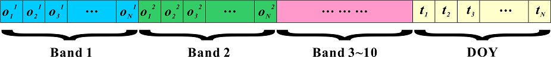

# SITS-BERT

This repository provides a PyTorch implementation of the pre-training scheme presented in our paper 
[Self-Supervised Pre-Training of Transformers for Satellite Image Time Series Classification]

## Citation and Contact

Pre-trained Transformer network for satellite image time series classification
This code is supporting by a paper published in IEEE Journal of Selected Topics in Applied Earth Observations and Remote Sensing.
You can find the paper at: https://ieeexplore.ieee.org/document/9252123.
**NOTE: If you use our work, please also cite the paper:

```
@ARTICLE{9252123,
  author={Y. {Yuan} and L. {Lin}},
  journal={IEEE Journal of Selected Topics in Applied Earth Observations and Remote Sensing}, 
  title={Self-Supervised Pre-Training of Transformers for Satellite Image Time Series Classification}, 
  year={2020},
  volume={},
  number={},
  pages={1-14},
  doi={10.1109/JSTARS.2020.3036602}}

```

Citation: Y. Yuan and L. Lin, "Self-Supervised Pre-Training of Transformers for Satellite Image Time Series Classification," 
in IEEE Journal of Selected Topics in Applied Earth Observations and Remote Sensing, doi: 10.1109/JSTARS.2020.3036602.

If you would like to get in touch, please contact yuanyuan@njupt.edu.cn.

## Abstract

Satellite image time series (SITS) classification is a major research topic in remote sensing
and is relevant for a wide range of applications. Deep learning approaches have been commonly
employed for SITS classification and have provided state-of-the-art performance. However, deep
learning methods suffer from overfitting when labeled data is scarce. To address this problem,
we propose a novel self-supervised pre-training scheme to initialize a Transformer-based network
by utilizing large-scale unlabeled data. In detail, the model is asked to predict randomly 
contaminated observations given an entire time series of a pixel. The main idea of our proposal
is to leverage the inherent temporal structure of satellite time series to learn general-purpose
spectral-temporal representations related to land cover semantics. Once pre-training is completed,
the pre-trained network can be further adapted to various SITS classification tasks by fine-tuning
all the model parameters on small-scale task-related labeled data. In this way, the general knowledge
and representations about SITS can be transferred to a label-scarce task, thereby improving the 
generalization performance of the model as well as reducing the risk of overfitting. Comprehensive
experiments have been carried out on three benchmark datasets over large study areas. Experimental 
results demonstrate the effectiveness of the proposed pre-training scheme, leading to substantial 
improvments in classification accuracy using Transformer, one-dimensional convolutional neural network 
(CNN-1D), and Bidirectional Long Short-Term Memory (Bi-LSTM) network. The code and the pre-trained 
model will be available at https://github.com/linlei1214/SITS-BERT upon publication.

## Requirements

+ tqdm = 4.48.2
+ numpy = 1.19.1
+ python = 3.6.10
+ pytorch = 1.6.0
+ tensorboard = 2.3.0

## Running Experiments

### Data Preparation

All the Sentinel-2 images (Level-1C) we used were downloaded from the United States Geological Survey
(USGS) EarthExplorer website and preprocessed to Bottom-Of-Atmosphere (BOA) reflectance Level-2A using
the Sen2Cor plugin v2.8 and the Sentinel Application Platform (SNAP 7.0). The Multispectral Instrument
(MSI) sensor provides 13 spectral bands, i.e., four bands at 10-m (Blue, Green, Red, NIR), six bands at
20-m (Vegetation Red Edge 1~3, Narrow NIR, SWIR 1~2), and three atmospheric bands at 60-m spatial resolution.
With the exception of the atmospheric bands, all 10 bands (i.e., Sentinel band-2,3,4,5,6,7,8,8A,11,12) 
were used in this study. Bands at 20-m resolution were resampled to 10-m via nearest sampling. A scene 
classification map was generated for each image along with the Level-2A processing, which assigned pixels
to clouds, cloud shadows, vegetation, soils/deserts, water, snow, etc. According to the scene classification
map, low-quality observations belonging to clouds (including cirrus), cloud-shadows, and snow were discarded
when extracting the annual time series of each pixel.

Time series data is organized in `CSV` format. Each row of a csv file corresponds to an annual satellite observation 
time series of a pixel. For each row, the storage order is [[observation data], [DOY data], [class label(optional)]],
 where [observation data] is stored in the order of bands:

A pre-training time series is recorded like this:

<div align="center">
  <br><br>
</div>

A fine-tuning time series is recorded like this:

<div align="center">
  <br><br>
</div>

Note: [DOY data] record the acquisition Julian dates of the observations in a time series. 
[class label] is not included in the pre-training data.


### Pre-Training SITS-BERT

The file `pretraining.py` is the main code for pre-training a SITS-BERT model.
All unlabeled time series are stored in a single csv file (e.g., `Pre-Training-Data.csv`), and the program 
can automatically split the data into training/validation sets according to the given `valid_rate`.

You can run the following Linux command for pre-training a SITS-BERT model on your own data.
```
python pretraining.py \
    --dataset_path '../data/California-Unlabeled/Pre-Training-Data.csv' \
    --pretrain_path '../checkpoints/pretrain/' \
    --valid_rate 0.03 \
    --max_length 64 \
    --num_features 10 \
    --epochs 100 \
    --batch_size 256 \
    --hidden_size 256 \
    --layers 3 \
    --attn_heads 8 \
    --learning_rate 1e-4 \
    --warmup_epochs 10 \
    --decay_gamma 0.99 \
    --dropout 0.1 \
    --gradient_clipping 5.0
  
```

We have provided the pre-trained model parameters for SITS-BERT, which are available in 
the `checkpoints\pretrain\` folder.

### Fine-Tuning SITS-BERT

The file `finetuning.py` is the main code for fine-tuning a pre-trained SITS-BERT model and using 
the fine-tuned model for satellite time series classification.
The sample dataset has been divided into training/validation/test sets, which are available 
in the `data\California-Labeled\` folder.

You can run the following Linux command to run the experiment:
```
python finetuning.py \
    --file_path '../data/California-Labeled/' \
    --pretrain_path '../checkpoints/pretrain/' \
    --finetune_path '../checkpoints/finetune/' \
    --max_length 64 \
    --num_features 10 \
    --num_classes 13 \
    --epochs 100 \
    --batch_size 128 \
    --hidden_size 256 \
    --layers 3 \
    --attn_heads 8 \
    --learning_rate 2e-4 \
    --dropout 0.1

```

You can also run the following command to train a SITS-BERT model from scratch for comparison:
```
python finetuning.py \
    --file_path '../data/California-Labeled/' \
    --finetune_path '../checkpoints/unpretrain/' \
    --max_length 64 \
    --num_features 10 \
    --num_classes 13 \
    --epochs 300 \
    --batch_size 128 \
    --hidden_size 256 \
    --layers 3 \
    --attn_heads 8 \
    --learning_rate 2e-4 \
    --dropout 0.1
	
	
```

## Disclosure
This implementation is based on the repository https://github.com/codertimo/BERT-pytorch, which is a Pytorch
implementation of Google AI's 2018 BERT:
[BERT: Pre-training of Deep Bidirectional Transformers for Language Understanding] 
Paper URL : https://arxiv.org/abs/1810.04805


